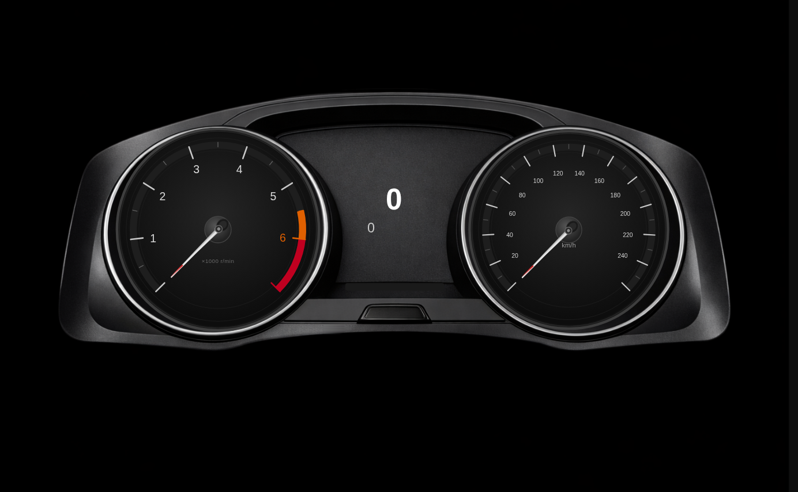
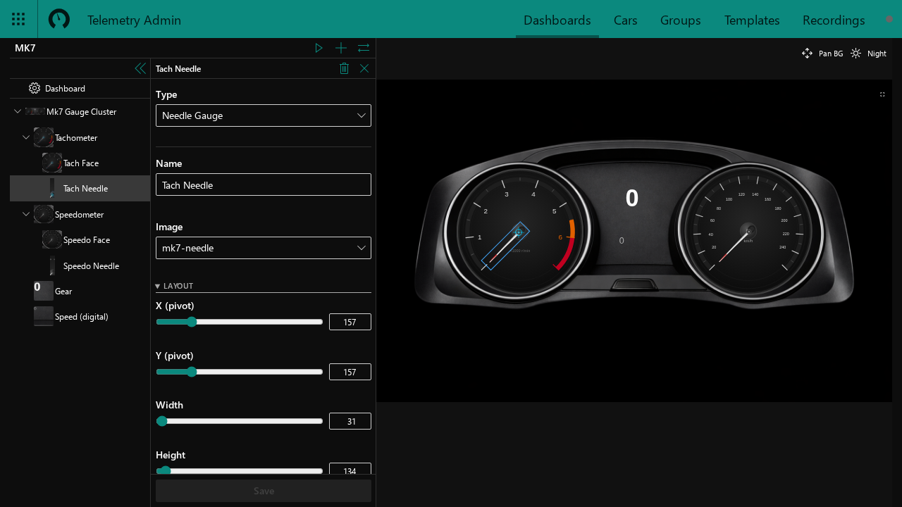
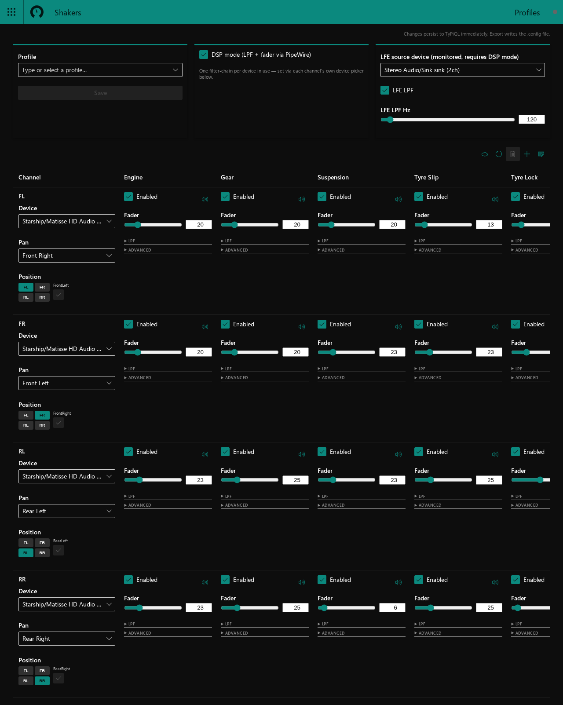
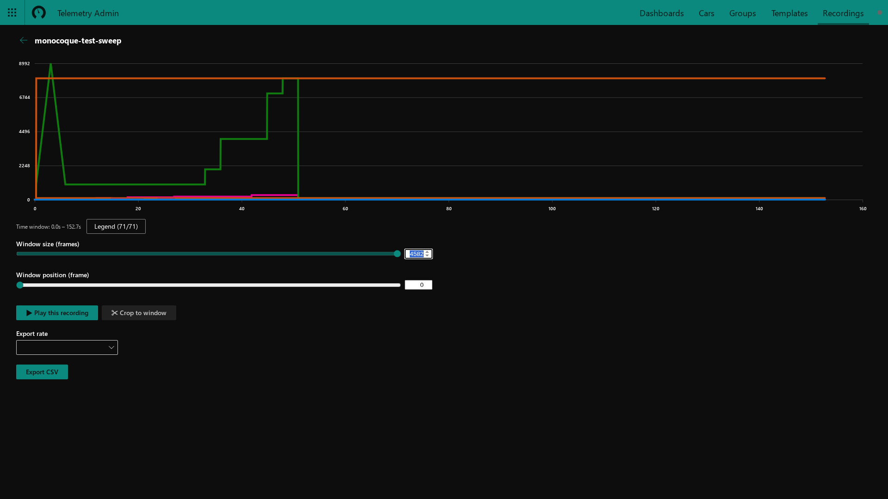

# monocoque-builder

A desktop app (Tauri + React/TypeScript frontend, Rust/Axum/GraphQL backend) for
building live sim-racing dashboards and controlling a physical shaker rig.

It's built around [typiql](https://github.com/MrDavid5465/typiql-rs), a small
Rust ORM that auto-generates full CRUD GraphQL (queries, mutations, live
subscriptions) from `#[typiql_type]`-annotated structs, plus a
[per-form](https://github.com/MrDavid5465/per-form) (a fork of
[octant/per-form](https://github.com/octant/per-form)) based schema-driven
form system on the frontend.

## What it does

- **Dashboard Designer** — a drag-and-drop editor for building live telemetry
  dashboards (gauges, gamepad-bound controls, flag displays, sequence
  playback) rendered against real or simulated sim telemetry.
- **Shaker rig control** — models a physical shaker channel setup
  (per-channel device/position/pan), drives
  [Monocoque](https://github.com/Spacefreak18/monocoque)'s config, and
  optionally routes shaker audio through a live PipeWire DSP filter-chain
  (per-channel LPF + fader, one chain per physical output device) for
  real-time tuning without restarting anything.
- **Telemetry admin** — car/photo management, dashboard groups, device
  routing, and template libraries, all backed by the same typiql schema.

## Screenshots

<p align="center">
  <br>
  <sub>A dashboard rendered live against sim telemetry</sub>
</p>

<p align="center">
  <br>
  <sub>Dashboard Designer — dragging and configuring gauges on the canvas</sub>
</p>

<p align="center">
  <br>
  <sub>Shaker rig control — per-channel device, pan, and effect fader matrix</sub>
</p>

<p align="center">
  <br>
  <sub>Recordings — replaying a captured telemetry session</sub>
</p>

## Stack

- Frontend: React, TypeScript, Vite, Apollo Client, Fluent UI, per-form.
- Backend: Rust, Axum, async-graphql, Tokio — served as a local HTTP/GraphQL
  API that the Tauri webview (and any other client) talks to.
- Storage: a single JSON document via `typiql-adapter-json`, no database
  required.

## Releases & installation

Every merge to `master` that includes a
[Conventional Commits](https://www.conventionalcommits.org/)-style commit
(`feat:`, `fix:`, etc.) is picked up by
[release-please](https://github.com/googleapis/release-please), which opens
a PR bumping the version and changelog; merging that PR tags a release and
triggers a build that attaches Linux packages to the corresponding
[GitHub Release](https://github.com/MrDavid5465/monocoque-builder/releases).
Only Linux builds are produced today — no Windows/macOS packages yet.

Install the latest release with whichever matches your distro:

- **Arch Linux (AUR)**: `paru -S monocoque-builder` (or your AUR helper of
  choice) — installs the `monocoque-builder` binary. The PKGBUILD is validated against
  a real Arch container on every PR; publishing to the AUR itself is a
  manual, deliberate step (see `.github/workflows/publish-aur.yml`).
- **Debian/Ubuntu**: download the `.deb` asset from the
  [latest release](https://github.com/MrDavid5465/monocoque-builder/releases/latest)
  and `sudo dpkg -i monocoque-builder_*.deb` (then `sudo apt-get install -f` if it
  reports missing dependencies).
- **Fedora/RPM-based**: download the `.rpm` asset and
  `sudo dnf install ./monocoque-builder-*.rpm` (or `rpm -i`).
- **Any other Linux**: download the `.AppImage` asset, `chmod +x` it, and
  run it directly — no install step required.

All three package formats need `webkit2gtk-4.1`, `gtk3`, and
`libayatana-appindicator` (or your distro's equivalent) available; the
`.deb`/`.rpm` declare these as dependencies, the AppImage does not bundle
them. The shaker DSP feature additionally needs PipeWire with
`pactl`/`pw-cli`/`pw-dump`.

A Flatpak build (`.github/workflows/flatpak.yml`) is also produced, and has
been verified co-installed alongside the monocoque Flatpak on a real system.

## Development

Requires Node.js, Rust, and (for the shaker DSP feature) PipeWire with
`pactl`/`pw-cli`/`pw-dump` available.

```bash
npm install
npm run tauri dev
```

This starts the Rust backend (serving GraphQL on `:9000`) and the Vite dev
server (`:1420`) together, opening the Tauri window pointed at the dev
server.

Run just the frontend against an already-running backend with `npm run dev`.
Tests: `npm test` (unit, Vitest) and `npm run test:e2e` (Playwright, mocked
GraphQL).

## License

MIT — see [LICENSE](./LICENSE).
